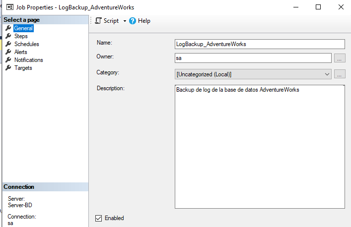
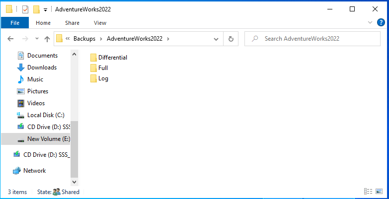

## Evidencias de la Ejecución de Backups y Recuperación de Datos

Se presentan las evidencias de la ejecución del stored procedure para la generación de backups, así como las pruebas de recuperación de datos realizadas.

---

### Ejecución de Backups

#### Ejecución Manual del Stored Procedure
A continuación se muestra la ejecución manual del stored procedure `sp_BackupDatabase` desde SQL Server

> El backup se generó correctamente.

### SQL Server Agent

#### Configuración de Jobs
Se configuraron jobs en SQL Server Agent para ejecutar el stored procedure automaticamente:

#### Ejemplo de job para la creacion de un backup completo de la base de datos Northwind

> **Descripción:** El job `FullBackup_Northwind_Weekly` fue programado para ejecutarse cada semana.

#### Ejemplo de job para la creacion de un backup diferencial de la base de datos AdventureWorks

> **Descripción:** El job `DifferentialBackup_AdventureWorks_Daily` fue programado para ejecutarse cada 24 horas (Diario).

#### Ejemplo de job para la creacion de un backup de log  de la base de datos AdventureWorks

> **Descripción:** El job `logBackup_AdventureWorks` fue programado para ejecutarse cada 15 minutos.

---

#### Estructura de Carpetas y Archivos Generados
Se muestra la estructura de carpetas y los archivos de backup generados:

> **Descripción:** Archivos de backup almacenados en la ruta correspondiente. Los nombres de los archivos incluyen un timestamp para evitar sobrescrituras.

### Pruebas de Recuperación de Datos

#### Recuperación mediante un Backup Completo (FULL)
Se realizó la restauración de un backup completo utilizando el archivo generado:

> Posterior a la restauracion de ejecuto una consulta para verificar que los datos se restauraron correctamente.

---

#### Conclusion
- El stored procedure `sp_BackupDatabase` genera backups de manera correcta y organizada , ademas La automatización con SQL Server Agent garantiza que los backups se ejecuten según la programación definida y las pruebas de recuperación confirman que los backups son utilizables en caso de alguna problematica.